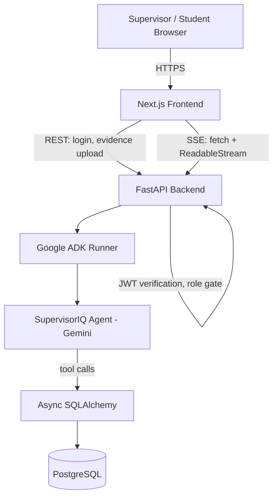

# AttachIQ

An AI-agent-powered platform for managing the industrial attachment assessment process at TVET (Technical and Vocational Education and Training) institutions in Kenya.

---

## Overview

AttachIQ is a multi-tenant web platform built to support the CBET (Competency-Based Education and Training) industrial attachment workflow: the mandatory field placement every TVET student in Kenya completes, during which a workplace supervisor is expected to assess them against defined competency criteria.

The platform is being built solo by a third-year Computer Science diploma student at The Kiambu National Polytechnic, initially as a submission concept for the Google for Startups AI Agents Challenge, and now as a real product with a working demo targeted for KINAP's 6th International Research Conference, Skills Competitions and Expo (October 2026).

AttachIQ is intended for three groups of users:

- **Supervisors** at host companies, who assess students against competency criteria
- **Students** on attachment, who submit evidence of the work they've completed
- **Coordinators and institution admins**, who oversee placements across an institution (planned; not yet built)

The system is not a generic learning management system. It is purpose-built around the specific structure of Kenya's CBET attachment process: competency units, performance criteria, evidence submissions, and supervisor sign-off.

## Problem Statement

Under the CBET framework, every TVET programme is broken into competency units with defined performance criteria and evidence requirements. In practice, the assessment process breaks down at every stage:

- Supervisors at host companies — most of them SMEs — have typically never seen the CBET framework and are asked to rate students against it without guidance
- Students receive no real-time direction on what evidence to collect or which competencies to focus on
- Coordinators, each managing large numbers of placements, have no visibility into a placement until the student returns at the end of the attachment period

Some institutions, including the author's own, have already digitized part of this process with a web portal: students self-assess and upload evidence files, supervisors log in and rate students against a list of criteria, and a transcript is generated automatically. This is real progress over paper logbooks, but it does not fix the underlying problem:

- The interface presents a list of criteria and asks for a rating — it does not explain what a good rating looks like or walk the supervisor through anything
- The rating step is not visibly tied to reviewing the specific evidence the student submitted for that criterion
- The coordinator-facing dashboard reports static counters, not insight — no alerts, no risk flags, no synthesis across placements
- There is no conversational interface anywhere in the system; every interaction is a form

**The gap AttachIQ addresses is not "nobody digitized the logbook." It is that digitizing a form does not fix the reason the process was broken in the first place.**

## Solution

AttachIQ sits on top of the same attachment workflow and adds an AI agent layer, built with Google's Agent Development Kit (ADK) and the Gemini API, that actively guides the people using the system instead of handing them another form.

The centerpiece of the current build is **SupervisorIQ**, an agent that:

1. Retrieves the assigned student's profile and pending competency units
2. Retrieves the specific evidence the student has already submitted for a unit
3. Presents that evidence to the supervisor in plain language
4. Asks 2–3 targeted follow-up questions based on the evidence and the competency criteria
5. Drafts a score and written comments for the supervisor to review
6. Submits the completed assessment to the database once the supervisor confirms it

This turns an unfamiliar rubric-reading exercise into a short guided conversation, and — critically — ties the assessment step directly to the evidence the student actually submitted, which the existing digitized workflow does not do.

## Key Features

### Core Functionality (implemented)

- Supervisor-facing conversational assessment flow (SupervisorIQ), streamed in real time
- Student evidence submission via file upload
- Competency unit and placement data model backing the assessment flow

### Authentication (implemented)

- JWT-based authentication (Bearer token)
- Login endpoint; token issuance on successful authentication
- Role-gated API access (the agent chat endpoint is restricted to the SUPERVISOR role)

### AI Functionality (implemented)

- SupervisorIQ agent built on Google ADK, backed by Gemini, with tool-calling against the real database (not a static prompt or a chatbot wrapper)
- Server-Sent Events (SSE) streaming of agent responses to the frontend

### Planned (not yet implemented)

- **StudentIQ** — a student-facing agent that recommends what to focus on based on real progress data
- **CoordIQ** — a coordinator-facing agent that surfaces at-risk placements proactively
- **AttachIQ Core** — an orchestrator agent that routes requests to the correct specialist agent by role (currently, role-based routing is handled by plain application logic, not an agent)
- Institution self-registration and admin-approval onboarding flow
- Coordinator and institution-admin portals
- Full multi-tenant isolation testing
- Cloud file storage (evidence is currently stored locally)
- JWT refresh token rotation (login-only auth is a known MVP gap)

## How It Works

The current, implemented flow for a supervisor completing an assessment:

1. The supervisor logs in through the frontend and receives a JWT
2. The supervisor opens the assessment chat screen, which opens a connection to the backend's `/agents/chat` endpoint using a manual `fetch` + `ReadableStream` (not the browser `EventSource` API, since `EventSource` cannot send a custom `Authorization` header)
3. The backend verifies the JWT and the SUPERVISOR role, then hands the message to a `Runner` driving the SupervisorIQ agent
4. SupervisorIQ calls its tools in sequence — student profile, pending units, competency detail, submitted evidence — against the PostgreSQL database via async SQLAlchemy
5. The agent presents the evidence and asks the supervisor targeted questions, streamed back to the frontend token-by-token over SSE
6. Once the supervisor answers, the agent drafts a score and comments and shows them for confirmation
7. On confirmation, the agent calls a tool that writes the completed assessment row to the database

## Architecture



**Frontend** — a Next.js application serving distinct screens per role (currently: login, supervisor assessment chat, student evidence upload).

**Backend** — a FastAPI application that owns authentication, REST endpoints, and the `/agents/chat` SSE endpoint. CORS middleware is enabled to allow the Next.js dev server to reach it.

**Agent layer** — Google ADK's `Runner` drives the SupervisorIQ `Agent` against a session. Session state is currently tracked in an in-process dictionary keyed by user ID (see [Design Decisions](#design-decisions)), rather than relying on ADK's built-in session lookup.

**Data layer** — PostgreSQL, accessed exclusively through async SQLAlchemy from both the API routes and the agent's tool functions.

## Technology Stack

| Layer              | Technology                                      | Purpose                                          |
| ------------------ | ----------------------------------------------- | ------------------------------------------------ |
| Frontend           | Next.js (App Router), TypeScript                | Supervisor/student-facing web application        |
| UI                 | Tailwind CSS, shadcn/ui (Base UI + Nova preset) | Component styling                                |
| Backend            | Python, FastAPI                                 | REST API, auth, SSE agent endpoint               |
| ORM                | Async SQLAlchemy, asyncpg                       | Database access                                  |
| Database           | PostgreSQL                                      | Persistent storage                               |
| AI agent framework | Google Agent Development Kit (ADK)              | Agent, Tool, and Runner abstractions             |
| AI model           | Gemini (`gemini-3.5-flash-lite`)                | Powers SupervisorIQ's reasoning and conversation |
| Auth               | Custom JWT                                      | Bearer-token authentication                      |
| File storage       | Local filesystem (MVP)                          | Evidence file uploads                            |
| Version control    | Git, GitHub                                     | Source control                                   |

## Project Structure

```text
attachiq/
├── apps/
│   ├── api/            # FastAPI backend
│   │   ├── main.py     # App entrypoint, CORS configuration
│   │   ├── routers/
│   │   │   └── agents.py   # /agents/chat SSE endpoint, SupervisorIQ wiring
│   │   └── .env.example
│   └── web/             # Next.js frontend
│       └── src/
│           └── app/     # Login, supervisor chat, student evidence upload
└── README.md
```

The backend intentionally has no nested `app/` subfolder — application code lives directly under `apps/api/`. The schema, remaining API routes, and broader directory layout are still being finalized on the `full-build` branch as the data model is revisited (see [Roadmap](#roadmap)).

## Prerequisites

- Python 3.12 or later
- Node.js 20 or later
- PostgreSQL 16
- A Google AI Studio API key with access to the Gemini API

## Installation

```bash
git clone https://github.com/arthurmchege/AttachIQ.git
cd AttachIQ
```

### Backend

```bash
cd apps/api
python -m venv venv
source venv/bin/activate
pip install -r requirements.txt
cp .env.example .env   # fill in your database URL, JWT secret, and Gemini API key
```

### Frontend

```bash
cd apps/web
npm install
```

## Environment Configuration

Backend configuration is managed through a `.env` file in `apps/api/`, based on the committed `.env.example`. At minimum, the backend requires:

| Variable                   | Required | Purpose                                              |
| -------------------------- | -------- | ---------------------------------------------------- |
| Database connection string | Yes      | Connects the async SQLAlchemy engine to PostgreSQL   |
| JWT signing secret         | Yes      | Signs and verifies issued access tokens              |
| Gemini / Google AI API key | Yes      | Authenticates SupervisorIQ's calls to the Gemini API |

No secret values are included in this repository or in `.env.example` — see that file for the exact variable names expected by the current codebase.

## Running the Project Locally

### Backend

```bash
cd apps/api
source venv/bin/activate
uvicorn main:app --reload
```

### Frontend

```bash
cd apps/web
npm run dev
```

By FastAPI and Next.js defaults, the backend and frontend are expected to run on ports 8000 and 3000 respectively during local development, unless overridden in configuration.

## API Documentation

FastAPI automatically exposes interactive API documentation at `/docs` (Swagger UI) and `/redoc` for any running instance, unless explicitly disabled in `main.py`.

The primary implemented endpoints are:

| Method | Endpoint                 | Description                                                                                |
| ------ | ------------------------ | ------------------------------------------------------------------------------------------ |
| POST   | `/auth/login`            | Authenticates a user and issues a JWT                                                      |
| POST   | `/agents/chat`           | JWT-protected, SUPERVISOR-role-gated SSE endpoint that streams a SupervisorIQ conversation |
| —      | Evidence upload endpoint | Accepts a student's evidence file (multipart form data)                                    |

Additional CRUD endpoints exist to support the reduced schema (institutions, programmes, competency units, placements) but are not yet stabilized enough to document individually here.

## Database

AttachIQ uses PostgreSQL with a reduced, seven-table schema for the current MVP:

- `institutions`
- `users`
- `programmes`
- `competency_units`
- `placements`
- `evidence_submissions`
- `assessments`

This schema is a deliberately scoped-down version of a larger, planned 16-table design (which adds performance elements, companies, coverage tracking, coordinator flags, field visits, notifications, and audit logs). The current full-build effort is actively revisiting parts of this schema — in particular, whether the flat `users` table with a role column should be split into role-specific profile tables — so the schema should be considered provisional rather than final.

## Authentication & Authorization

- Authentication is JWT-based: a client logs in and receives a Bearer access token
- The token is presented on subsequent requests via the `Authorization` header
- The `/agents/chat` endpoint enforces both a valid JWT and a SUPERVISOR role check before allowing access
- **Known gap:** the current implementation supports login only — there is no refresh token, and no rotation mechanism yet
- A broader role model (student, supervisor, coordinator, institution admin) is designed but not fully implemented; only the supervisor-facing flow is authorization-gated end to end today

## Testing

There is no automated test suite in the current codebase. Verification during development has followed a gate-driven, manual process: each function (in particular, each SupervisorIQ tool) was tested and its output verified — via `curl`, `psql`, and print-statement debugging — before being committed, rather than relying on an automated framework. Formalizing this into a `pytest` suite is an open item, not yet done.

## Deployment

AttachIQ is not currently deployed to production. Development and verification have taken place locally. A production deployment target (Cloud Run for the backend, Vercel for the frontend, managed PostgreSQL) has been discussed as part of the project's longer-term design but has not been implemented or configured in this repository.

## Security

- JWT Bearer-token authentication on protected routes
- Role-based access check on the agent chat endpoint
- CORS middleware configured on the backend to allow the frontend origin
- SQL injection is mitigated by exclusive use of the SQLAlchemy ORM for database access
- **Known gap:** the frontend currently stores the JWT in `localStorage` rather than an HTTP-only cookie, and there is no refresh token rotation — both are documented as areas to revisit before production use

## Observability

No logging, error tracking, or monitoring infrastructure has been implemented yet. This is an open item for the full-build phase.

## Design Decisions

### Decision: Session tracking via a plain dictionary instead of ADK's built-in session lookup

**Reason:** `InMemorySessionService.get_session()` was found to silently fail to retrieve previously created sessions during testing.
**Alternative:** Continue relying on ADK's session service as documented.
**Trade-off:** Tracking each supervisor's `Session` object directly in a dictionary keyed by user ID works reliably, but limits the MVP to one active conversation per supervisor at a time, and loses all in-progress conversations on server restart.

### Decision: Manual `fetch` + `ReadableStream` for SSE consumption instead of the browser `EventSource` API

**Reason:** `EventSource` cannot send a custom `Authorization` header, which the JWT-protected `/agents/chat` endpoint requires.
**Alternative:** Use `EventSource` and pass the token as a query parameter.
**Trade-off:** The manual approach keeps the token out of the URL (and therefore out of logs), at the cost of implementing stream parsing by hand on the frontend.

### Decision: `gemini-3.5-flash-lite` over `gemini-3.5-flash`

**Reason:** Verified via Google AI Studio's rate limit dashboard that the lite model offers a materially higher free-tier daily request quota than the standard flash model.
**Alternative:** Use the standard flash model, or enable billing.
**Trade-off:** Higher free-tier throughput for development, at the cost of the standard model's capability ceiling — acceptable for the current MVP scope.

### Decision: Reduced 7-table schema for the MVP instead of the full 16-table design

**Reason:** Getting one complete workflow (supervisor assessment) working end to end against real data was prioritized over building the full data model before any of it was proven out.
**Alternative:** Build the full 16-table schema upfront.
**Trade-off:** Faster path to a working demo, at the cost of schema rework now underway as the project moves into full production build.

## Known Limitations

- Only one agent (SupervisorIQ) is fully implemented; StudentIQ, CoordIQ, and the orchestrator agent do not yet exist
- One active agent conversation per supervisor at a time; conversation state is lost on server restart
- No refresh token rotation; login-only JWT auth
- Evidence files are stored on local disk, not cloud storage
- No automated test suite
- No CI/CD pipeline
- No production deployment
- The database schema is provisional and under active revision as part of the full-build effort
- Multi-tenant data isolation has not yet been tested

## Roadmap

**Completed**

- Reduced 7-table schema, seeded with demo data
- JWT login
- SupervisorIQ working end to end against real data, verified via `psql`
- Login, supervisor assessment chat (SSE), and student evidence upload screens, connected to the real backend

**In Progress**

- Revisiting the schema and role model (institution admin, coordinator, student, supervisor) for the full production build
- Institution registration and admin-approval onboarding flow

**Planned**

- StudentIQ agent
- CoordIQ agent
- AttachIQ Core orchestrator agent
- Coordinator and institution-admin portals
- Full multi-tenant isolation
- Cloud file storage
- Automated test suite and CI/CD
- Production deployment (Cloud Run, Vercel, managed PostgreSQL)

## Contributing

This is currently a solo, personal project under active development and not yet open for external contributions. That may change after the current build phase stabilizes.

## License

This project does not currently specify an open-source license.

## Author

**Arthur Mulunda**

Email: [arthurmulunda941@gmail.com](mailto:arthurmulunda941@gmail.com)

GitHub: [github.com/arthurmchege/AttachIQ](https://github.com/arthurmchege/AttachIQ)
